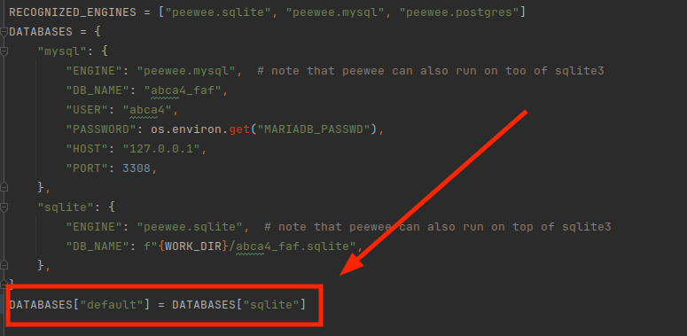
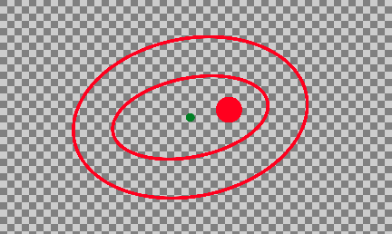
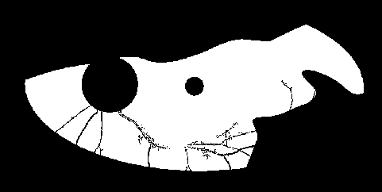

# About

This repo contains a set of tools for the analysis of retinal fundus autofluorescence images.
So far it has been usd in "Quantifying the progression of Stargardt disease ... etc" by Mihalek at al,
submitted for publication.

# Reporting issues and contributing
If you would like to help fixing and building on this code, please report any issues in the issue
tracker of this repo, or create a branch and make a pull request.

# Installing the code


# Trying out a Demo

This brief into assumes that you can find your way around python - using virtual environment, 
installing missing packages, and running scripts from the command line or from within your favorite IDE.


## Providing the information about the images

The csv/tsc should have the following columns, in arbitrary order:
"patient alias", "image path", "eye". It also may contain the columns names
"haplotype tested", "is control", "onset age", "age acquired",  "height", "width", "disc x", "disc y",  "fovea x",  and  "fovea y". 

Note that you can export a table in csv format from any major spreadsheet application.

Here is an example input table (note: the patient data is invented, for the purposes of this demo):

| | | | | | | | | | | | | |
|-|-|-|-|-|-|-|-|-|-|-|-|-|
|patient alias|haplotype tested|is control|onset age|eye|age acquired|image path|width|height|disc x|disc y|fovea x|fovea y|
|130508|n|n|20|OD|40|/home/ivana/projects/ABCA4/images/asrs-rib-image-130508.jpg|3968|3968|2640|1958|1974|1941|
|130509|n|n|20|OS|40|/home/ivana/projects/ABCA4/images/asrs-rib-image-130509.jpg|3916|3916|1490|2029|2106|2024|
|71476|n|n|6|OD|18|/home/ivana/projects/ABCA4/images/asrs-rib-image-71476.jpg|935|619|476|333|565|363|

To use averaging over the left and the right eye, please provide, additionally, a table that specifies
which images correspond to the eye pair of the same person and taken during the same visit.

| | |
|-|-|
|left eye|right eye|
|/home/ivana/projects/ABCA4-faf/images/asrs-rib-image-130509.jpg|/home/ivana/projects/ABCA4-faf/images/asrs-rib-image-130508.jpg|

### Sample input

Here is a possible sample input.
Note that you will have to create a (free) account with [Retina Image Bank](https://imagebank.asrs.org) 
to download the images

* https://imagebank.asrs.org/file/71476/stargardt-disease  
* https://imagebank.asrs.org/file/130508/stargardt-disease 
* https://imagebank.asrs.org/file/130509/stargardt-disease


## Finding the approximate locations of fovea and disc in faf images

For demo purposes, please provide the image dimensions andn
This can be done, foe example, by opening a FAF image uing [GIMP](https://www.gimp.org/) 
(a public-domain image manipulation program), placing the cursor over your best guess for the fovea or disc centers,
and reading off the coordinates in the lower left corner.

## Choosing your db server

This code uses [Peewee ORM](http://docs.peewee-orm.com/en/latest/), 
and was tested to work with MySQL and SQLite. The easiest way to start is with 
SQLite, in which case you do not have to do anything except making sure that SQLit si selected 
in `faf00_settings.py` file. See below.

## Settings

Fill in the values in `faf00_settings.py`. 




In particular, you will need a work directory where
scripts can store auxiliary files, if needed.  It should be specified as 
`WORK_DIR` variable in the `faf00_settings.py` file. 

## Basic sanity checking

If `faf01_settings_sanity_check.py` is not executable, make it so (not needed if you
are using and IDE), and run.
You don't have to run this script, but if you do it will 
do some basic sanity checking for the settings you have provided.
If it complains about the sqlite database missing, run `faf02_db_tables.py` first and then
return to this step.

## Creating and loading the database

Run `faf02_db_tables.py`. It will create a database with empty tables to be filled the
image info. The scripts downstream will use the information you provided there, and also 
store their own results therein.

If you use tab as the field separator, please give the file the extension ".tsv" because the separator is
guessed from the extension (',' for a csv, and '\t' for tsv file.)

Then use the infomration tables you have created to fill the database:

```shell
./faf03_load_image_info.py images/images.tsv
./faf04_load_image_pair_info.py images/image_pairs.tsv 
```

## Further image sanity checking

To do some further sanity checking on the images - such as that the files actually exist, and the
fovea and disc centers are inside the image bounds, do

```shell
./faf05_img_sanity_checks.py
```

## Creating ROI overlays

```shell
./faf06_disc_macula_ellipse_overlay.py 
```

`faf06_disc_macula_ellipse_overlay.py`  creates a transparent background overlay image
to be used in manual steps and sanity checking downstream. Overlayas are simple transparent
images that should ook like this:



## Manual labeling of usable and bg sampling regions
If the images challenging because of the presence of the artifacts, the artifact-free 
('usable') region and the background intensity distribution sampling region might
have to be determined manually. 
See [manual_labeling](faf09_manual_preproc/manual_labeliing.md).

## Auto-detection of bg sampling regions
In high-quality images, the background intensity distribution sampling region can 
be determined automatically. 
See [auto_labelling](faf10_automatable/auto_labelling.md).


## Blood vessel detection and mask creation


```shell
./faf12_blood_vessel_detection.py 
./faf15_mask_creation.py 
./faf15_mask_creation.py -l
```

In all commands
* `-h|--help` flag to print out the help message
* `-x|--skip_xisting` 
will skip re-creating the  overlay / blood vessel / mask image if one is already found in the 
work directory. 
* `-p|--pdf` will create a pdf file in the `WORKIDR/reports` directory for quick manual inspection
of the images created

A note about the parallelization: these script also take `-n|--n-cpus` option, however, due to 
an oversight in the current implementation (Aug 2024) it does not work in the cases where sqlite is used
as a storage.

`faf07_blood_vessel_detection.py` uses combination of traditional image processing methods
to detect the outline of the blood vessels in each of the input images. It may fail in the cases
of low contrast images, such as srs-rib-image-130508.jpg here, or in the cases of advanced Stargardt disease,
when the large hypofluorescent areas start obscuring the vasculature.

`faf08_mask_creation.py` will create ROI mask, like this one, for example


(this is a rather extreme example where a good chunk of the fundus view was obscured by eyelids / eyelashes.)

`faf08_mask_creation.py -l` will create a larger mask, to be used in deciding where to take a sample
that represents the background distribution of intensities. 

## Selecting reference (background region)
