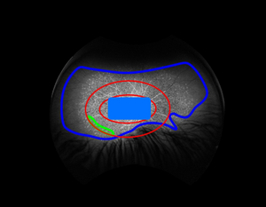
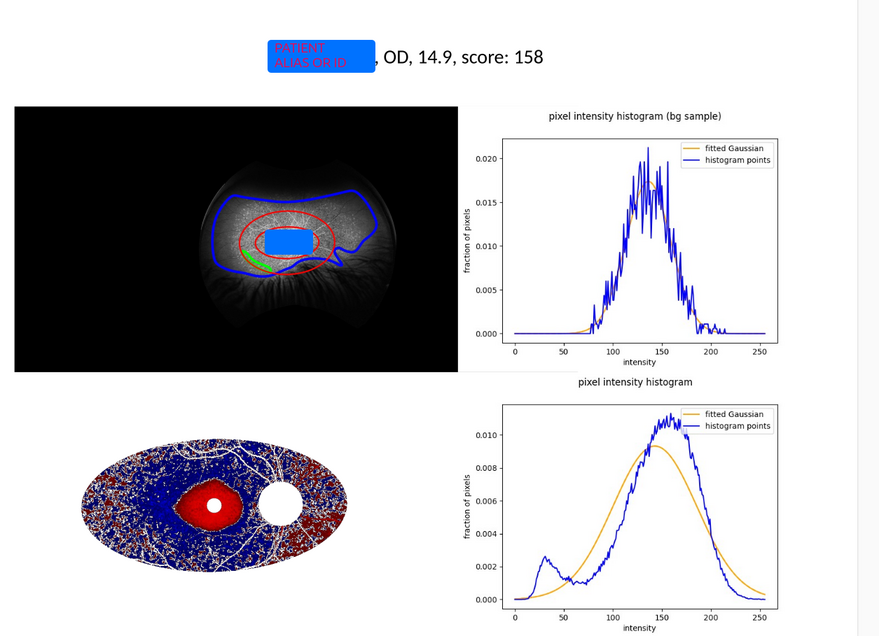

Work in progress, Oct 22, 2024

# About

This repo contains a set of tools for the analysis of retinal fundus autofluorescence images.
If you find it useful in your research, please cite 

>Mihalek, Ivana, et al. "Quantifying the Progression of Stargardt Disease in Double-Null ABCA4 
Carriers Using Fundus Autofluorescence Imaging." 
Translational Vision Science & Technology 14.3 (2025): 16-16. 
(<a href="https://tvst.arvojournals.org/article.aspx?articleid=2802701" target="_blank">journal link</a>)

# Reporting issues and contributing
If you would like to help fixing and building on this code, please report any issues in the issue
tracker of this repo, or create a branch and make a pull request.

# Installing the code

```bash
python3 -m venv venv
. venv/bin/activate
pip install -r requirements.txt
```
For a simple tryout using sqlite, you can comment out the psycopg2 or mysqldb lines from requirements.txt.

# Trying out a Demo

This brief intro assumes that you can find your way around python - using virtual environment, 
installing missing packages, and running scripts from the command line or from within your favorite IDE.


## Providing the information about the images

The csv/tsc should have the following columns, in arbitrary order:
"patient alias", "image path", "eye". It also may contain the columns names
"haplotype tested", "is control", "onset age", "age acquired",  "height", "width", "disc x", "disc y",  "fovea x",  and  "fovea y". 

Note that you can export a table in csv format from any major spreadsheet application.

Here is an example input table (note: the patient data is invented, for the purposes of this demo):

| | | | | | | | | | | | | |
|-|-|-|-|-|-|-|-|-|-|-|-|-|
|patient alias|haplotype tested|is control|onset age|eye|age acquired|image path|width|height|disc x|disc y|fovea x|fovea y|
|130508|n|n|20|OD|40|/home/ivana/projects/ABCA4/images/asrs-rib-image-130508.jpg|3968|3968|2640|1958|1974|1941|
|130509|n|n|20|OS|40|/home/ivana/projects/ABCA4/images/asrs-rib-image-130509.jpg|3916|3916|1490|2029|2106|2024|
|71476|n|n|6|OD|18|/home/ivana/projects/ABCA4/images/asrs-rib-image-71476.jpg|935|619|476|333|565|363|

To use averaging over the left and the right eye, please provide, additionally, a table that specifies
which images correspond to the eye pair of the same person and taken during the same visit.

| | |
|-|-|
|left eye|right eye|
|/home/ivana/projects/ABCA4-faf/images/asrs-rib-image-130509.jpg|/home/ivana/projects/ABCA4-faf/images/asrs-rib-image-130508.jpg|

### Sample input

Here is a possible sample input.
Note that you will have to create a (free) account with [Retina Image Bank](https://imagebank.asrs.org) 
to download the images

* https://imagebank.asrs.org/file/71476/stargardt-disease  
* https://imagebank.asrs.org/file/130508/stargardt-disease 
* https://imagebank.asrs.org/file/130509/stargardt-disease


## Finding the approximate locations of fovea and disc in faf images

For demo purposes, please provide the image dimensions andn
This can be done, foe example, by opening a FAF image uing [GIMP](https://www.gimp.org/) 
(a public-domain image manipulation program), placing the cursor over your best guess for the fovea or disc centers,
and reading off the coordinates in the lower left corner.

## Choosing your db server

This code uses [Peewee ORM](http://docs.peewee-orm.com/en/latest/), 
and was tested to work with MySQL, postgres, and SQLite. The easiest way to start is with 
SQLite, in which case you do not have to do anything except making sure that SQLite si selected 
in `faf00_settings.py` file. See below.

## Settings

Fill in the values in `faf00_settings.py`. 


In particular, you will need a work directory where
scripts can store auxiliary files, if needed.  It should be specified as 
`WORK_DIR` variable in the `faf00_settings.py` file. 

## Work directory naming conventions

The auxilary files will be stored in a directory subtree in `WORKDIR`, grouped by the
patient alias, for example
```bash
├── Patient1
│├── auto_bg_histograms
│├── auto_bgs
│├── bg_histograms
│├── composites
│├── elliptic_masks
│├── outer_masks
│├── overlays
│├── recals
│├── roi_histograms
│└── vasculatures
├── Patient2
│├── auto_bg_histograms
│├── auto_bgs
│├── bg_histograms
│├── composites
│├── elliptic_masks
│├── outer_masks
│├── overlays
│├── recals
│├── roi_histograms
│└── vasculatures
├── reports
│├── auto_bg_histogram.pdf
│├── bg_histogram.pdf
│├── lu45667o8s5n.tmp
│└── overlay.pdf
.
.
.
```

## Basic sanity checking

If `faf01_settings_sanity_check.py` is not executable, make it so (not needed if you
are using and IDE), and run.
You don't have to run this script, but if you do it will 
do some basic sanity checking for the settings you have provided.
If it complains about the sqlite database missing, run `faf02_db_tables.py` first and then
return to this step.

## Creating and loading the database

Run `faf02_db_tables.py`. It will create a database with empty tables to be filled the
image info. The scripts downstream will use the information you provided there, and also 
store their own results therein.

If you use tab as the field separator, please give the file the extension ".tsv" because the separator is
guessed from the extension (',' for a csv, and '\t' for tsv file.)

Then use the infomration tables you have created to fill the database:

```shell
./faf0301_load_image_info.py images/images.tsv
./faf0303_load_image_pair_info.py images/image_pairs.tsv 
```

## Further image sanity checking

To do some further sanity checking on the images - such as that the files actually exist, and the
fovea and disc centers are inside the image bounds, do

```shell
./faf05_img_sanity_checks.py
```

## Creating ROI overlays

```shell
./faf06_disc_macula_ellipse_overlay.py 
```

`faf06_disc_macula_ellipse_overlay.py`  creates a transparent background overlay image
to be used in manual steps and sanity checking downstream. Overlayas are simple transparent
images that should ook like this:


Note the inner and outerellipses, centered on the fovea, and dimensions specified in
[faf00_settings.py](faf00_settings.py):

```python
# geometry parameters used in fundus analysis
# the unit distance is the distance between the centers of optic disc and fovea
GEOMETRY = {
    "disc_radius": 1 / 3,
    "fovea_radius": 1 / 9,
    "ellipse_radii": (2, 1),
    "outer_ellipse_radii": (3, 2),
    "cropping_radii": (3, 2),
}
```


## Manual labeling of usable and bg sampling regions
If the images challenging because of the presence of the artifacts, the artifact-free 
('usable') region and the background intensity distribution sampling region might
have to be determined manually. 
See [manual_labeling](faf04_manual_preproc/manual_labeliing.md).

## Auto-detection of bg sampling regions
In high-quality images, the background intensity distribution sampling region can 
be determined automatically. 
See [auto_labelling](faf10_automatable/auto_labelling.md).


## Selecting reference (background) region

As of this writing (late Aug, 2024) we have no way of automatically detecting artifacts 
in FAF images, so the analysis pipeline starts with manually delineating the region within
eyelashes, shadows, hair, etc. If the inner ellipse is within this region, we take it as 
a signal that the image is of reasonable quality, and an automatic way
of detecting a background sampling region can be attempted. Otherwise, we resort to manually 
delineating the background sampling region.

Note, however, that automatic selection of the bg region might still be impossible, because
the hypoflurescent region has already covered most of the _outer_ ellipse, where we suggest the bg
sampling region should be placed

### Is the inner ellipse within the usable region?

Use [faf10_automatable/faf1001_find_clean_view_imgs.py](faf10_automatable/faf1001_find_clean_view_imgs.py). 
The images  in which the inner ellipse is partly covered by the artifacts will set to False  the boolean field
'celan_view' in the 'faf_images' table in the database.

### Manually delineate background sampling region
See [faf09_manual_preproc/manual_labeliing.md](faf04_manual_preproc/manual_labeliing.md)

### Scripted bg sampling region delineation

Use [faf10_automatable/faf1002_auto_bg_regions.py](faf10_automatable/faf1002_auto_bg_regions.py). 
To restrict your analysis to the images with the clean view of the ROI (the inner ellipse) pass the 
`-v/--clean_vew_only` flag to the script.

## Background histograms and image recalibration

Note that we  use the recalibrated images only 
for the purpose of blood vessel detection. Empirically, the blood
vessel detection works better on recalibrated images, while we
prefer to leave the images un-manipulated for the scoring purpose.

Collect background histogram data using [faf12_background_hists.py](faf12_background_hists.py)
This script will fall back on manually delineated background regions if the auto bgs are not available.

To create recalibrated images in the WORKDIR specified in `faf00_settings.py`, run
[faf13_img_recalibration.py](faf13_img_recalibration.py). `-h` to see the options.

Blood vessel detection is currently a simple heuristic using traditional image processing tools
from Piillow and scikit-image:
[faf15_blood_vessel_detection.py](faf15_blood_vessel_detection.py). The heuristic is rather fragile,
and will likely be replaced in the future.

## Blood vessel detection and mask creation


```shell
./faf13_blood_vessel_detection.py 
./faf17_mask_creation.py 
./faf17_mask_creation.py -l
```

In all commands
* `-h|--help` flag to print out the help message
* `-x|--skip_xisting` 
will skip re-creating the  overlay / blood vessel / mask image if one is already found in the 
work directory. 
* `-p|--pdf` will create a pdf file in the `WORKIDR/reports` directory for quick manual inspection
of the images created

A note about the parallelization: these script also take `-n|--n-cpus` option, however, due to 
an oversight in the current implementation (Aug 2024) it does not work in the cases where sqlite is used
as a storage.

`faf13_blood_vessel_detection.py` uses combination of traditional image processing methods
to detect the outline of the blood vessels in each of the input images. It may fail in the cases
of low contrast images, such as srs-rib-image-130508.jpg here, or in the cases of advanced Stargardt disease,
when the large hypofluorescent areas start obscuring the vasculature.

`faf17_mask_creation.py` will create ROI mask, like this one, for example


(this is a rather extreme example where a good chunk of the fundus view was obscured by eyelids / eyelashes.)

`faf17_mask_creation.py -l` will create a larger mask, to be used in deciding where to take a sample
that represents the background distribution of intensities. 


## Region composites

[faf18_image_region_composites.py](faf30_production/faf55_image_region_composites.py)
This step is optional, but advisable - create (for manual inspection) composite images
consisting of the original image, with the elliptical ROI, fove and optic head, usable and bg sampling regions overlaid:



They should wind up in the work directory (refer to the
work directory tree above), and look something like this:


Note that the `-p` flag is needed to produce the pdf version of the report.
Alternatively, `-s` can be used to produce pptx files, 
though these tend to be rather voluminous.


## The difference in brightness between the inner and the outer ellipse 

Run 
```bash
faf22_roi_histograms.py -c
```

followed by
```bash
faf22_roi_histograms.py -c -l
````

and finally
```bash
23_gradient_correction.py
````

This number should be used as a correction for using 
the reference region in the outer ellipse, by setting 
`SCORE_PARAMS["gradient_correction"]` in `faf00_settings.py` to that number.
```python
SCORE_PARAMS = {
    "black_pixel_weight": 10,
    "gradient_correction": myvalue_here
}
```

**Caveat**: if the control images are not  of the
same quality as the clinical images analyzed (and / or obtained
under very similar conditions), this does not really help.


## Histogram progression

THis is a strictly optional step, used for producing an illustration
in the original paper
[faf25_hist_progression.py](faf30_production/faf53_hist_progression.py)

The output should look like

## Image scoring

And, finally, we get to score the FAF images in our set

```bash
faf25_pixel_score.py
faf3001_score_vs_time_plot.py
faf3002_score_sensitivity_to_fovea_location.py  # note this one takes very long
faf3005_score_od_vs_os_plot.py
faf3006_score_comparison.py
```

## More reporting and analysis tools
<br>


#### An illustration of hist shape change over time
```bash
faf3008_hist_progression.py  
```
<br>

#### An illustration of image regions used in the analysis
```bash
faf3010_image_region_composites.py 
```
One illustration should look like this (without the blue square in the center):


amd the script can create a 'catalogue' of such images in pdf format whn used with `-p` option.
Works for manually selected background regions only.

<br>


#### Text description of the dataset
```bash
./faf3012_dataset_overview.py
```
The output should look something like
```bash
    We included images from 21 visits. 
    A total of 1-12 images (median 2) 
    spanning 0.0-6.4 (median 0.0) were obtained in each patient. The first of these was obtained 
    at a median age of 10.3 years (range 5.2–19.4). 
    The median interval between follow-up visits was 2.0 (range 0.3–6.4).    
```

<br>

#### Case catalog

Note: the following script expects that [faf12_background_hists.py](faf12_background_hists.py) 
and  [faf22_roi_histograms.py](faf22_roi_histograms.py) 
were  run for all cases (just run with the default options, 
wihtout `-c` option that limits the run to controls). 


It also expects the images produced by running [faf28_pixel_score.py](faf28_pixel_score.py) with `-p` option.
```bash
./faf3016_case_catalog.py
```
The output will be a catalog in pdf format, showing the illustration (heatmap) of the
pixel level scores and histograms collected in the ROI and the background regions, like this:


<br>

#### Score catalog

Similar to the above, except the images are shown as pairs,
and the patient cases sorted by the increasing average score.

```bash
faf3018_score_catalog.py
```

## Odds and ends

Visualisation of the idea behind the heuristic score used here.

```bash
faf5000_score_simulation.py
```
