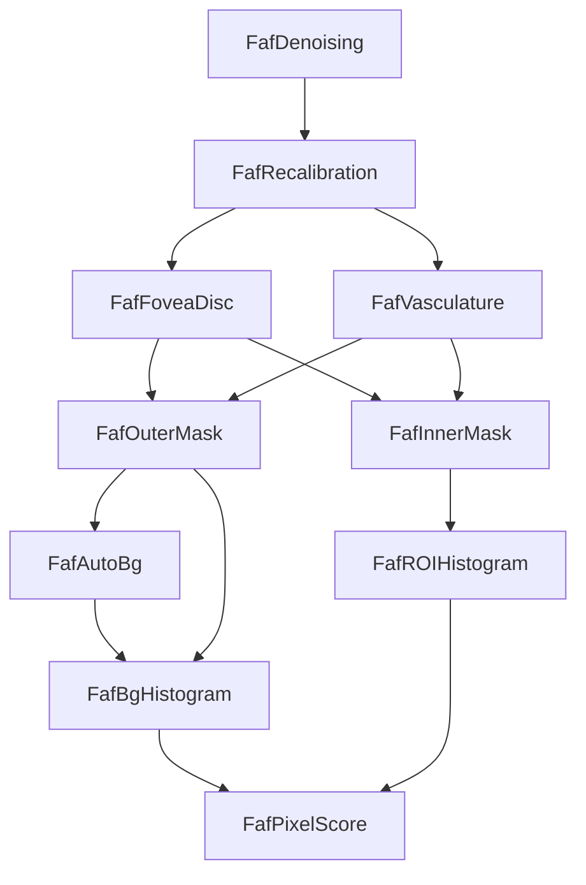

# ABCA4 FAF Analysis

Analysis pipeline for FAF (Fundus Autofluorescence) images related to ABCA4.



## Getting Started

This project requires Python 3.13 or higher. We recommend using `uv` for dependency management and `virutalenv` (or `venv`) for isolation.

### Installation

1.  **Clone the repository:**
    ```bash
    git clone <repository_url>
    cd ABCA4-faf
    ```

2.  **Create a virtual environment:**
    Using standard `venv`:
    ```bash
    python3.13 -m venv venv
    source ./venv/bin/activate
    ```
    
    Or using `uv` (recommended):
    ```bash
    uv venv --python 3.13
    source ./venv/bin/activate
    ```

3.  **Install dependencies:**
    This project uses `pyproject.toml`. You can install the project in editable mode with its dependencies using `uv` or `pip`.

    Using `uv` (faster):
    ```bash
    # If using uv sync (with uv.lock)
    uv sync
    
    # Or strict pip install
    uv pip install -e .
    ```

    Using `pip`:
    ```bash
    pip install -e .
    ```

### A note on installing uv

To avoid the scary message from snap:
```txt
error: This revision of snap "astral-uv" was published using classic confinement and thus may
       perform arbitrary system changes outside of the security sandbox that snaps are usually
       confined to, which may put your system at risk.
```
use 
```bash
curl -LsSf https://astral.sh/uv/install.sh | sh
```
This will install uv in  $HOME/.local/bin


## Documentation

*   **[Pipeline Execution](doc/PIPELINE.md)**: Detailed instructions on how to start the pipeline, run the CLI, and understand the workflow.
*   **[Individual Scripts](doc/INDIVIDUAL_SCRIPTS.md)**: A brief reference for the individual scripts and modules located in the `src` directory.

## Pipeline Quick Start

Once installed, you can use the `pipeline` command:

```bash
# List available jobs
pipeline list-jobs

# Run pipeline on an image
pipeline run /path/to/image.tiff
```
