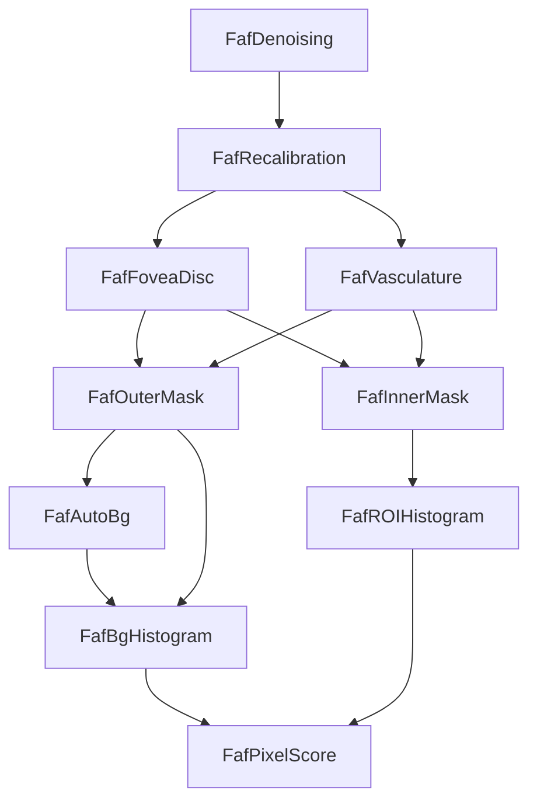

```mermaid
graph TD
    FafDenoising["FafDenoising"]
    FafRecalibration["FafRecalibration"]
    FafFoveaDisc["FafFoveaDisc"]
    FafAutoBg["FafAutoBg"]
    FafVasculature["FafVasculature"]
    FafInnerMask["FafInnerMask"]
    FafOuterMask["FafOuterMask"]
    FafBgHistogram["FafBgHistogram"]
    FafROIHistogram["FafROIHistogram"]
    FafPixelScore["FafPixelScore"]

    FafDenoising --> FafRecalibration
    FafRecalibration --> FafFoveaDisc
    FafRecalibration --> FafVasculature
    FafFoveaDisc --> FafInnerMask
    FafFoveaDisc --> FafOuterMask
    FafAutoBg --> FafBgHistogram
    FafVasculature --> FafInnerMask
    FafVasculature --> FafOuterMask
    FafInnerMask --> FafROIHistogram
    FafOuterMask --> FafAutoBg
    FafOuterMask --> FafBgHistogram
    FafBgHistogram --> FafPixelScore
   FafROIHistogram --> FafPixelScore
```
